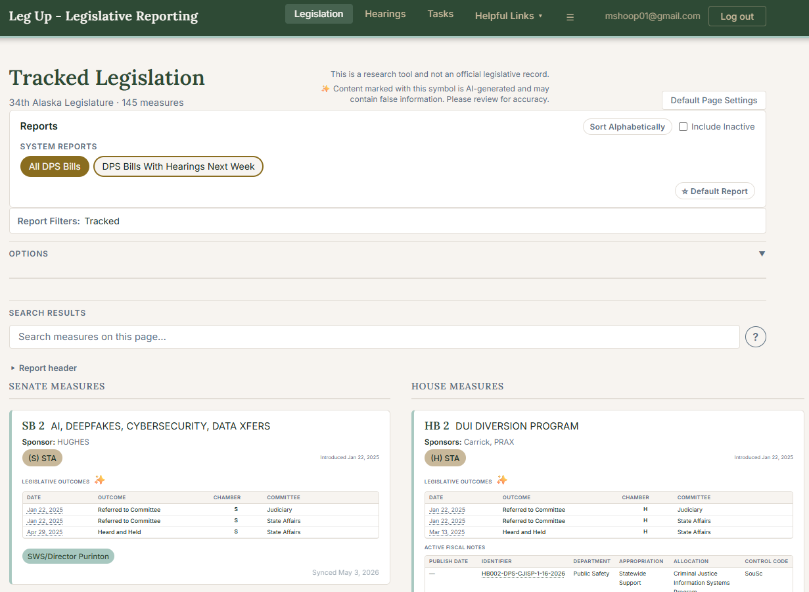
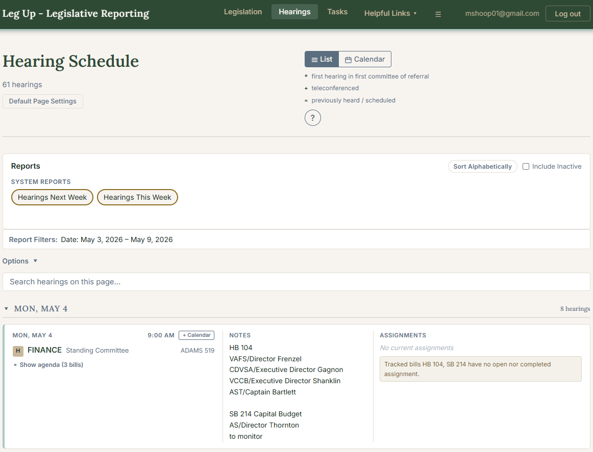
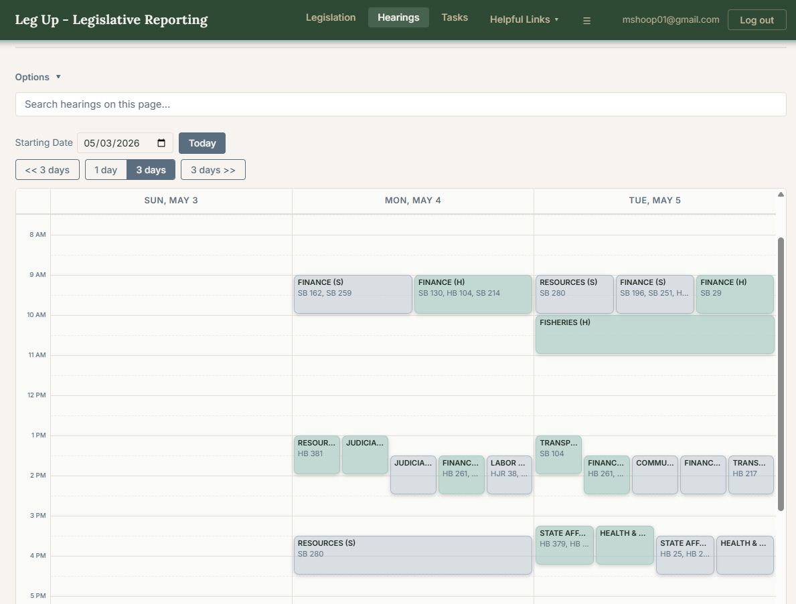
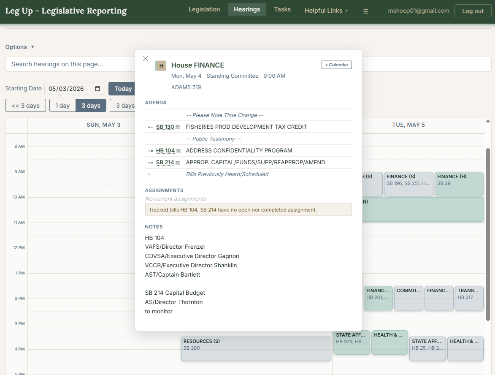
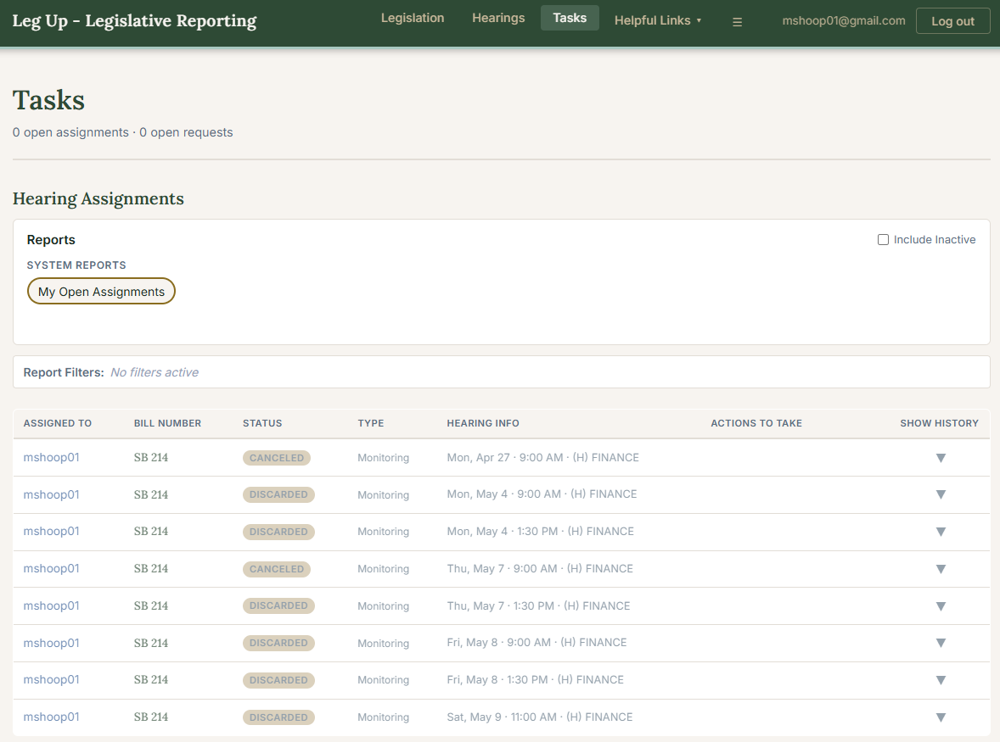
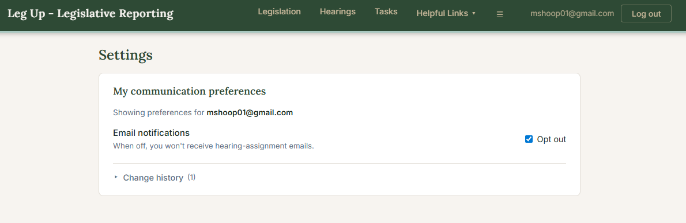
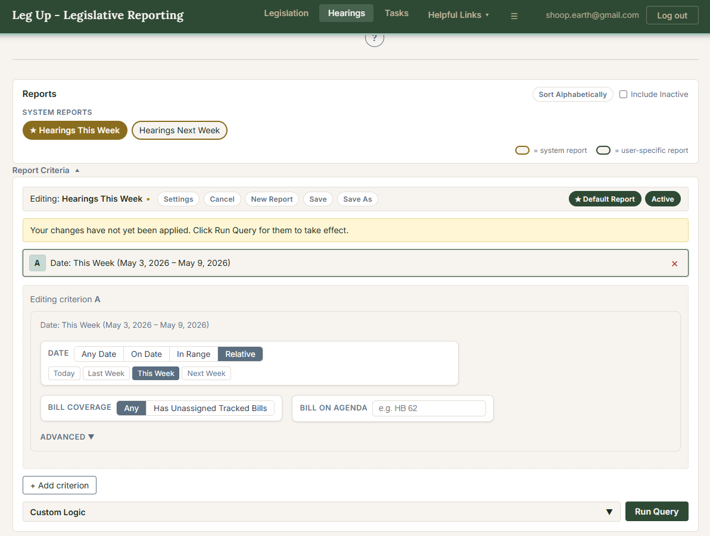

# Leg Up — Alaska Legislature Liaison Tool for DPS

**Leg Up** is a web application built for Alaska Department of Public Safety liaisons to monitor and report on the Alaska State Legislature. It tracks bills of interest, scrapes weekly committee hearing schedules, manages hearing assignments and tracking requests across a team, produces saved reports with stacking-criteria filters, and emails assignees when work is delegated to them.

Production: [www.aklegup.com](https://www.aklegup.com)

---

## Features

### Bill tracking
- Search and track bills across the active Alaska Legislature session; tag bills and filter by outcome type
- Bill events scraped from akleg.gov and analyzed by Mistral AI to extract structured hearing outcomes (passed, failed, referred to committee, etc.)
- Fiscal note tracking with department/appropriation/allocation metadata

### Hearing schedule
- Weekly committee hearings scraped from akleg.gov with full agenda items, teleconference flags, and prefix symbols
- **List view** — full reporting (Stacking Criteria + Saved Reports + search)
- **Calendar view** — day-at-a-glance grid with date navigation and Show Hidden / Show Inactive toggles
- DPS notes attach to each hearing and persist across scrapes
- Inactive hearing tracking — when a hearing is removed from the schedule its row is deactivated rather than deleted; liaisons are warned when a deactivated version has notes attached
- Hidden flag lets liaisons remove hearings from the standard view and PDF without deleting them

### Tasks (hearing assignments + tracking requests)
- **Hearing Assignments** — assign a hearing to a staff member with assignment type (`monitoring` / `awareness`), track status through `assigned` → `complete` / `canceled` / `reassigned`, capture a cancellation reason, and view full action history
- **Bill Tracking Requests** — request that a bill be tracked, with assignment + completion workflow
- An automatic suggester proposes hearing assignments based on bills already being tracked

### Reporting (Stacking Criteria + Saved Reports)
- **Stacking Criteria** — multi-row filter framework with a free-text boolean expression bar (e.g. `(A AND B) OR C`); each row wraps a full sub-filter. Empty expression = AND of all rows
- **Relative filter modes** — date filters support Today / Last Week / This Week / Next Week, and assignee filters support a "Me" relative value, both resolved at query time so saved reports stay correct over time
- **Saved Reports** — persistent named reports stored per user, with a Reports bar for quick selection and a per-page Default Report. Read-only by default; Edit unlocks Save
- **System-level reports** — admins can publish reports visible to selected user roles (e.g. *Hearings This Week*, *My Open Assignments*, *Tracked Bills*, *Open Tracking Requests*); admins always see every system report
- **PDF export** — formatted report with hearing schedule followed by tracked bills and outcomes

### Email notifications
- Assignment-created and assignment-canceled emails delivered via Postmark with deterministic Message-IDs so cancellations thread under the original in Gmail
- Per-user opt-out (Settings page or one-click `/opt-out/<token>` link); opt-out re-checked at send time
- Admin-editable email templates with markdown body, server-side HTML preview, and Test Send to the editing admin's address
- Background worker drains the `email_notifications` queue every 30s with `FOR UPDATE SKIP LOCKED`; cancellations and creations resolve sensibly when both queue before either sends

### Auth & users
- **Email-based registration** — self-service: user requests an activation link, receives it via Postmark, and sets a password (Argon2id hashed)
- **Password reset** — same email-link flow via `/forgot-password`
- JWT-based session with an amber **Session Expired** banner + reauth modal when a token expires mid-session
- Rate-limited (slowapi) on register / forgot-password / token validation
- **RBAC** — roles, permissions, and per-row security filters in the reporting registry; permissions include `hearing:query`, `workflow:view-all`, `email-template:edit`, `system-report:edit`, `comm-prefs:admin`, etc.
- **Display names** — users have an optional `name`; dropdowns and assignee cells show `name || email` while history actor columns stay email-only. Admins can edit names from Settings
- Admins can mark assignments complete on behalf of others

### Background sync
- Bill scraper runs daily at 4 AM Alaska time and on startup
- Hearing scheduler refreshes the active week's hearings on its own cadence
- Hearing assignment suggester runs in the background

---

## Screenshots

**Legislation page**


**Hearings page - list view**


**Hearings page - calendar view**


**Hearings page - calendar view - hearing opened**


**Tasks page**


**Settings page**


**Report Criteria**


**Hearing Assignment**


---

## Tech Stack

| Layer | Technology |
|---|---|
| Backend | Python 3.12, FastAPI, SQLAlchemy 2 (async), asyncpg |
| Database | PostgreSQL |
| Migrations | Alembic |
| Scraping | Playwright, BeautifulSoup4, pdfplumber |
| AI analysis | Mistral AI |
| Auth | Argon2id (argon2-cffi), JWT (python-jose), itsdangerous (opt-out tokens), slowapi |
| Email | Postmark, markdown + premailer for inlined HTML |
| Frontend | React 18, Vite, React Router, CSS Modules |
| PDF export | react-to-print |

---

## Project Structure

```
akleg-liaison/
├── backend/
│   ├── app/
│   │   ├── models/          # SQLAlchemy ORM models
│   │   ├── repositories/    # Database access layer
│   │   ├── routers/         # FastAPI route handlers
│   │   ├── schemas/         # Pydantic request/response schemas
│   │   └── services/        # Scraping, scheduling, AI, email worker, dispatcher
│   ├── alembic/             # Database migrations
│   ├── tests/
│   ├── .env.example
│   └── requirements.txt
└── frontend/
    ├── src/
    │   ├── api/             # Fetch wrappers (auth, bills, hearings, workflows, reports, …)
    │   ├── components/      # FilterBar, StackingCriteria, SavedReports, HearingAssignmentsPanel, …
    │   ├── context/         # Auth context
    │   ├── hooks/           # useSavedReports, …
    │   ├── pages/           # Home (Legislation), Hearings, Requests (Tasks), QueryBill,
    │   │                    # Login/Register/ForgotPassword/ActivateToken/SetPassword,
    │   │                    # EmailTemplates, Settings, OptOut
    │   └── utils/           # weekBounds, criteriaSentinels, criteriaMigration, …
    └── index.html
```

---

## Getting Started

### Prerequisites

- Python 3.12+
- Node.js 18+
- PostgreSQL
- A [Mistral AI](https://mistral.ai) API key
- A [Postmark](https://postmarkapp.com) server token (for auth + assignment emails)

### Backend Setup

```bash
cd backend

# Create and activate a virtual environment
python -m venv .venv
source .venv/bin/activate  # Windows: .venv\Scripts\activate

# Install dependencies
pip install -r requirements.txt

# Install Playwright browser
playwright install chromium

# Configure environment
cp .env.example .env
# Edit .env with your database URL, Mistral key, secret key, and Postmark token
# Generate a secret key with: python -c "import secrets; print(secrets.token_hex(32))"

# Run database migrations
alembic upgrade head

# Start the backend
uvicorn app.main:app --reload
```

The API will be available at `http://localhost:8000`. Interactive docs are at `http://localhost:8000/docs`.

### Frontend Setup

```bash
cd frontend

npm install
npm run dev
```

The app will be available at `http://localhost:5173`. The Vite dev server proxies all `/api` requests to the backend.

---

## Environment Variables

Copy `backend/.env.example` to `backend/.env` and fill in the values:

| Variable | Description |
|---|---|
| `DATABASE_URL` | PostgreSQL connection string (`postgresql+asyncpg://...`) |
| `MISTRAL_API_KEY` | API key from [console.mistral.ai](https://console.mistral.ai) |
| `SECRET_KEY` | Random secret for JWT signing — generate with `secrets.token_hex(32)` |
| `POSTMARK_SERVER_TOKEN` | Postmark server token for transactional email |
| `FRONTEND_BASE_URL` | Base URL used to build links in emails (`http://localhost:5173` in dev, `https://www.aklegup.com` in prod) |
| `COOKIE_SECURE` | `false` in local dev (HTTP); `true` in production (HTTPS) |

---

## Usage

### Creating an account

Go to `/register`, enter your email, and request an activation link. Postmark sends a one-time link; clicking it sets a session cookie and lets you choose a password (Argon2id hashed). The same flow at `/forgot-password` covers password reset.

There is no shared registration key — account creation is gated by email delivery, and an admin must grant any roles/permissions a new user needs beyond defaults.

### Tracking bills and hearings

On the **Legislation** page, search and tag bills, mark them tracked, and filter with Stacking Criteria. On the **Hearings** page, use the **List** tab for full reporting and the **Calendar** tab for a day-at-a-glance grid; both refresh automatically when criteria change. Click **Apply Changes** to commit edits to the criteria bar.

Hearing data is scraped automatically; admins can also trigger a scrape from the schedule UI.

### Hearing assignments and tracking requests

On the **Tasks** page, view your open Hearing Assignments and Bill Tracking Requests, mark items complete, request reassignment, or (admin) cancel with a reason. Assignees receive a Postmark email with the bill, hearing, and assignment-type details, and a one-click opt-out link.

### Saved reports

In any reporting page (Legislation, Hearings list, Tasks), build a criteria set and click **Save As** to persist it. The Reports bar shows your saved reports plus any system-level reports your roles allow you to view; clicking a report loads its criteria. Use **Default Report** to pick the report that should auto-load on each visit. Admins with `system-report:edit` can save reports as system-level and choose which non-admin roles see them.

### Exporting a PDF report

On the **Legislation** page, optionally set a hearing date range in the Export PDF controls. If a range is set, the PDF opens with the hearing schedule followed by all tracked bills; otherwise only the bill list is exported.

### Opting out of email

From **Settings**, toggle email notifications and view the change history. The same toggle is exposed on every notification email as a one-click `/opt-out/<token>` link (90-day TTL). Admins with `comm-prefs:admin` can adjust other users' preferences.
